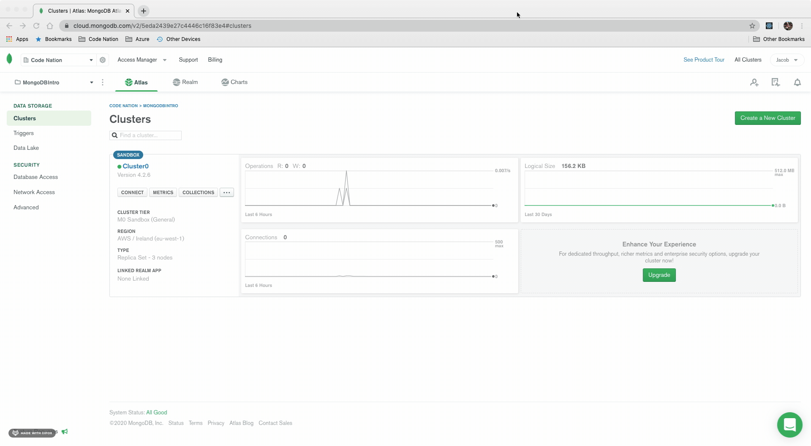
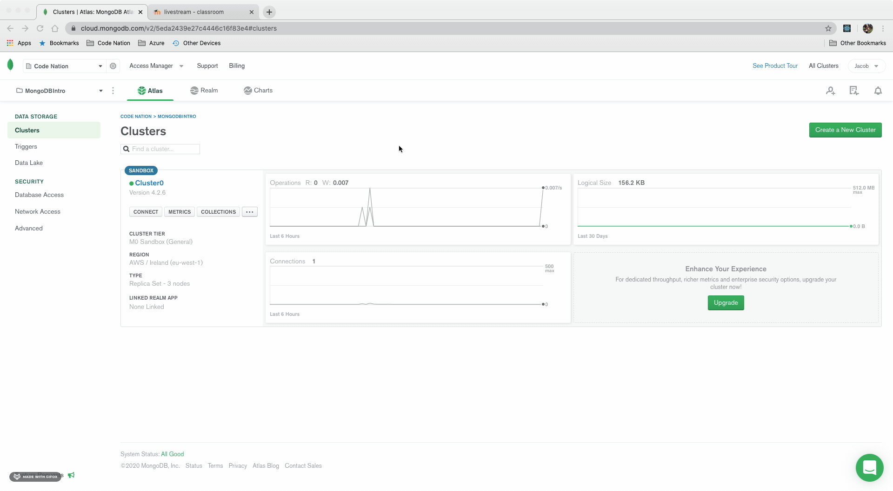

# Setting up MongoDB template

0. Prerequisites: 
    * MongoDB Atlas account found here: [MongoDB Atlas](https://www.mongodb.com/cloud/atlas)
    * Node installed on your computer: [Node.js](https://nodejs.org/en/download/)
    * The Mongoose documentation open to dive deeper: [Mongoose](https://mongoosejs.com)
    * [VSCode](https://code.visualstudio.com/) installed

1. Initialise the project with 
``` 
npm init -y 
```

2. Basic folder structure for our application

```
project
│   index.js
│   
└───models
│      user.js

```

3. Install mongoose & dotenv and require them inside of your index.js
```
npm i mongoose dotenv
```
``` javascript 
require('dotenv').config();
const mongoose = require('mongoose');
```
4. Inside of your user.js, we will now create our [schema](https://mongoosejs.com/docs/guide.html). 

Our schema shows the structure we want our User to contain, in this case, we are looking for a name, email and password. Each is a String and they are all required when submitting to the database.
```javascript
const mongoose = require('mongoose');
// const { Schema, model } = require('mongoose');

const User = new mongoose.Schema({
    name: { type: String, required: true },
    email: { type: String, required: true, unique: true },
    password: { type: String, required: true }
})

module.exports = mongoose.model('users', User);
```
5. We set up the .env before, so let's use that now! In our index.js, below our mongoose require, put the following: 
```javascript
// requiring our User schema from the user.js file
const User = require('./models/user');

// using mongoose to connect to our database. 
mongoose.connect(`${process.env.databaseURL}`, {
    useNewUrlParser: true,
    useUnifiedTopology: true
})
```
6. We have a process.env.databaseURL but no env variable in our .env. Let's sort that:

```
databaseURL=yourownurlhere
```
You can find your URL in the connect section below. Make sure to replace your <username><password><dbname> variables with ones that match your mongodb setup:


7. After we have connected our database, we need to send some data to it: 
```javascript
const user = new User({
    name: 'user',
    email: 'user@user.com',
    password: 'ilovemongo' // super secure.
})

user.save();
```

8. Head to our MongoDB cluster and follow the collections tab to see our new user:
